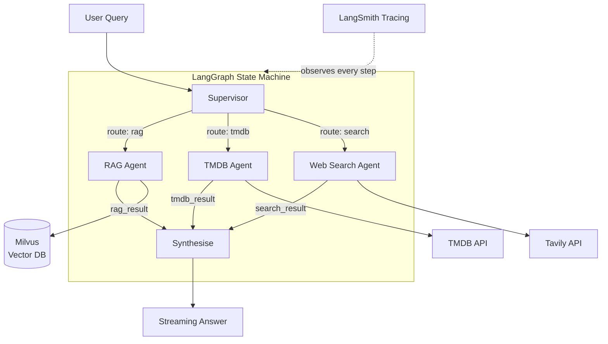

# Multi-Agent Research Pipeline

> 🚀 **Live demo:** [smartmoviesearch.com](https://smartmoviesearch.com) — running on the Groq free tier (100k tokens/day), so queries may be unavailable if the daily limit is reached. The ⚙️ status button in the app shows current availability.

A production agentic RAG system built with **LangGraph + Milvus**, deployed as [SmartMovieSearch](https://smartmoviesearch.com) — a natural-language movie intelligence platform.

A **Supervisor** agent intelligently routes each user question to the right
sub-agent — a **RAG agent** that searches a curated knowledge base, a **TMDB agent**
that queries live movie data, a **Web Search agent** for current news, or any
combination — then synthesises the results into a single coherent streaming answer.

---

## Architecture



The graph is a compiled **LangGraph `StateGraph`** — stateful, multi-turn, and
deployable via Docker Compose.

**State schema (`CineState` TypedDict):**

| Key | Type | Description |
|---|---|---|
| `question` | `str` | User question — set at entry |
| `routing` | `str` | `"tmdb"` \| `"rag"` \| `"search"` \| combinations |
| `rag_result` | `str\|None` | Output from the RAG agent |
| `tmdb_result` | `str\|None` | Output from the TMDB agent |
| `search_result` | `str\|None` | Output from the web search agent |
| `answer` | `str\|None` | Synthesised final answer |
| `history` | `list` | Multi-turn conversation memory |

---

## Tech Stack

| Layer | Technology |
|---|---|
| Agent orchestration | [LangGraph](https://github.com/langchain-ai/langgraph) 1.2+ |
| LLM | [Groq](https://groq.com) `llama-3.3-70b-versatile` |
| Vector database | [Milvus](https://milvus.io) 2.5+ — hybrid BM25 + dense search |
| Embeddings | OpenAI `text-embedding-3-small` |
| Movie data | [TMDB API](https://www.themoviedb.org/documentation/api) |
| Web search | [Tavily](https://tavily.com) |
| Backend | FastAPI + Server-Sent Events (SSE) streaming |
| Frontend | React + TypeScript + Vite |
| Observability | [LangSmith](https://smith.langchain.com) (optional) |
| Deployment | Docker Compose + Nginx + Cloudflare |

### AI/ML Pipeline Ecosystem

Real production pipelines connect components across these layers:

| Layer | Popular Tools | What it does |
|---|---|---|
| **Orchestration** | LangGraph, LangChain, CrewAI, AutoGen | Connects agents, manages state, controls flow |
| **Vector DB** | Milvus, Pinecone, Qdrant, Weaviate, Chroma | Stores embeddings for RAG |
| **LLM Serving** | vLLM, Ollama, LangServe, FastAPI | Runs models efficiently |
| **Observability** | LangSmith, Phoenix, Helicone, LangFuse | Tracing, debugging, monitoring agents |
| **Data Pipelines** | Airflow, Dagster, Prefect | Heavier batch/ETL orchestration |

---

## Quick Start

### 1. Install Docker

```bash
sudo apt update && sudo apt install docker.io docker-compose -y
sudo systemctl enable --now docker
sudo usermod -aG docker $USER && newgrp docker
```

### 2. Start the full stack

```bash
cd cineai/
cp backend/.env.example backend/.env   # fill in your API keys
docker compose up -d
```

Wait ~30 seconds for Milvus to become healthy, then verify:

```bash
curl http://localhost:8001/api/health
# → {"status":"ok","service":"smartmoviesearch-backend"}
```

### 3. Ingest the knowledge base

```bash
docker compose exec backend python scripts/ingest.py docs/
# → ✓ Inserted 168 chunks (hybrid BM25 + dense collection)
```

### 4. Open the app

Navigate to [http://localhost:5174](http://localhost:5174).

---

## Project Structure

```
pipeline/
│
├── cineai/                         SmartMovieSearch application
│   ├── docker-compose.yml          Full stack (Milvus + backend + frontend + Attu)
│   ├── nginx.conf                  Production nginx config
│   │
│   ├── backend/
│   │   ├── src/
│   │   │   ├── main.py             FastAPI app — SSE streaming, /api/status, /api/knowledge
│   │   │   ├── config.py           Centralised config (reads .env)
│   │   │   ├── agents/
│   │   │   │   ├── supervisor.py   Routing node — classifies query to agent(s)
│   │   │   │   ├── rag_agent.py    Hybrid Milvus retrieval (BM25 + dense, RRF fusion)
│   │   │   │   ├── tmdb_agent.py   TMDB search, discovery, filmography comparison
│   │   │   │   ├── search_agent.py Tavily web search
│   │   │   │   └── synthesiser.py  Merges agent outputs → streaming final answer
│   │   │   ├── graph/
│   │   │   │   └── pipeline.py     LangGraph StateGraph (compiled, multi-turn)
│   │   │   └── tools/
│   │   │       ├── milvus_retriever.py  Hybrid search wrapper
│   │   │       └── tmdb_client.py       TMDB API client
│   │   ├── docs/                   RAG knowledge base (markdown)
│   │   └── scripts/
│   │       └── ingest.py           Document ingestion CLI
│   │
│   └── frontend/
│       └── src/
│           ├── App.tsx             Main app — SSE client, streaming answer, panels
│           └── components/
│               ├── StatusModal.tsx  Live service health + API key status
│               ├── KnowledgeModal.tsx  Browse RAG knowledge base
│               ├── PipelineGraph.tsx   Real-time agent routing visualisation
│               ├── AgentTimeline.tsx   Per-agent latency breakdown
│               └── EventLog.tsx        Full SSE event stream
│
└── src/                            Original base pipeline (CLI)
    ├── agents/                     Supervisor, RAG, search agents
    ├── graph/pipeline.py           Core LangGraph StateGraph
    └── tools/                      Milvus + Tavily wrappers
```

---

## How It Works

### 1. Routing (Supervisor)

The supervisor classifies each question into a routing decision using a single
cheap LLM call. The result deterministically selects which agents run:

```python
# src/agents/supervisor.py
decision = await llm.ainvoke([
    SystemMessage(content=ROUTE_SYSTEM_PROMPT),
    HumanMessage(content=question),
])
# → "tmdb" | "rag" | "search" | "tmdb+rag" | "all" | …
```

### 2. Parallel fan-out

When the route includes multiple agents, LangGraph's `add_conditional_edges`
fans out to all of them simultaneously:

```python
# src/graph/pipeline.py
def dispatch(state) -> list[str]:
    routing = state["routing"]
    agents = []
    if "tmdb"   in routing: agents.append("tmdb_agent")
    if "rag"    in routing: agents.append("rag_agent")
    if "search" in routing: agents.append("search_agent")
    return agents or ["rag_agent"]
```

### 3. Hybrid RAG (BM25 + Dense)

The RAG agent uses Milvus 2.5's native sparse vector support to run BM25 and
dense retrieval simultaneously, then fuses results via RRF (Reciprocal Rank
Fusion):

```python
sparse_req  = AnnSearchRequest(query_sparse, "sparse_vector", {"drop_ratio_search": 0.2}, top_k)
dense_req   = AnnSearchRequest(query_dense,  "dense_vector",  {"metric_type": "IP"}, top_k)
results     = client.hybrid_search([sparse_req, dense_req], RRFRanker(k=60))
```

### 4. SSE streaming

The FastAPI backend streams structured events over SSE — routing decisions,
agent starts/ends, LLM tokens, retrieved chunks, usage stats — so the frontend
can render the pipeline in real time:

```
pipeline_start → routing_decision → agent_start →
  llm_start → token (×N) → llm_end →
  chunks_retrieved / tmdb_results →
agent_end → done
```

### 5. Synthesis

All agent results land in state. The synthesiser always invokes the LLM
(never short-circuits), ensuring token streaming reaches the frontend for
every query.

---

## Observability with LangSmith

When `LANGCHAIN_TRACING_V2=true`, every graph execution is automatically
traced — no instrumentation code required. The LangSmith UI shows:

- Which agent was routed to and why
- Exact prompts and completions at each node
- Token usage and latency per step
- Full state at every edge transition

---

## API Reference

| Endpoint | Description |
|---|---|
| `GET /api/query?q=<question>&thread_id=<id>` | SSE stream — pipeline events + streaming answer |
| `GET /api/status` | Live health: Groq / Milvus / TMDB + API key presence |
| `GET /api/knowledge` | RAG knowledge base summary (sources + chunk counts) |
| `GET /api/trending` | Trending movies from TMDB |
| `GET /api/history?thread_id=<id>` | Conversation history for a thread |
| `GET /api/health` | Health check |

---

## Roadmap

- [ ] **RAGAS evaluation** — automated retrieval quality metrics (Faithfulness, Answer Relevancy, Context Precision) against a curated test set
- [ ] **Redis semantic cache** — skip the LLM for repeated or near-identical queries
- [ ] **Streaming tokens in Event Log** — surface token stream in the observability panel alongside the answer
- [ ] **User-provided documents** — API endpoint to ingest uploaded files into a per-session collection
- [ ] **Multi-modal** — poster image embeddings alongside text for visual similarity search
