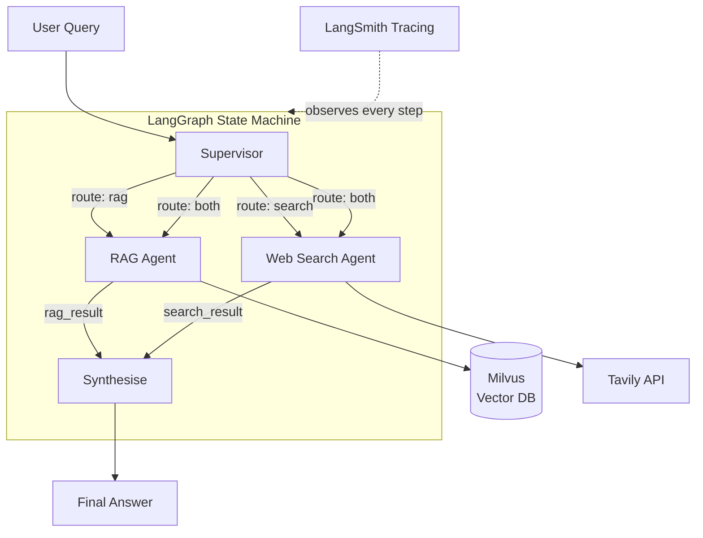

# Multi-Agent Research Pipeline

> 🚀 **Live demo:** [smartmoviesearch.com](https://smartmoviesearch.com) — running on the Groq free tier (100k tokens/day), so queries may be unavailable if the daily limit is reached. The ⚙️ status button in the app shows current availability.

A production-minded agentic RAG system built with **LangGraph + Milvus**.

A **Supervisor** agent intelligently routes each user question to the right
sub-agent — a **RAG agent** that searches your own documents, a **Web Search
agent** that queries the live web via Tavily, or both — then synthesises the
results into a single coherent answer.

Built for production deployment on commodity hardware.
Extends the RAG pattern into full multi-agent orchestration.

---

## Architecture



The graph is a compiled **LangGraph `StateGraph`** — stateful, inspectable,
and easy to extend with new agents or tools.

**State schema (`PipelineState` TypedDict):**

| Key | Type | Description |
|---|---|---|
| `query` | `str` | User question — set at entry |
| `route` | `str` | `"rag"` \| `"search"` \| `"both"` |
| `rag_result` | `str\|None` | Output from the RAG agent |
| `search_result` | `str\|None` | Output from the web search agent |
| `final_answer` | `str\|None` | Synthesised final answer |

---

## Tech Stack

This project's stack:

| Layer | Technology |
|---|---|
| Agent orchestration | [LangGraph](https://github.com/langchain-ai/langgraph) 1.1+ |
| LLM | OpenAI `gpt-4o-mini` or local Ollama |
| Vector database | [Milvus](https://milvus.io) 2.5+ (Docker) |
| Embeddings | OpenAI `text-embedding-3-small` or Ollama `nomic-embed-text` |
| Web search | [Tavily](https://tavily.com) (free tier) |
| Observability | [LangSmith](https://smith.langchain.com) (optional) |
| Vector DB UI | [Attu](https://github.com/zilliz/attu) (bundled in Compose) |

### The Broader AI/ML Pipeline Ecosystem (2026)

Real production pipelines are built by connecting components from each of these layers.
This project covers orchestration, vector DB, LLM serving, and observability — the four
key layers in a modern AI platform stack.

| Layer | Popular Tools | What it does |
|---|---|---|
| **Orchestration** | LangGraph, LangChain, CrewAI, AutoGen | Connects agents, manages state, controls flow |
| **Vector DB** | Milvus, Pinecone, Qdrant, Weaviate, Chroma | Stores embeddings for RAG |
| **LLM Serving** | vLLM, Ollama, LangServe, FastAPI | Runs models efficiently |
| **Observability** | LangSmith, Phoenix, Helicone, LangFuse | Tracing, debugging, monitoring agents |
| **Data Pipelines** | Airflow, Dagster, Prefect | Heavier batch/ETL orchestration |

> **LangGraph is currently the #1 answer** when asked "how do you build agentic pipelines?" — it sits directly on top of LangChain and gives you stateful, inspectable, production-deployable graphs.

---

## Quick Start

### 1. Install Docker (Ubuntu 25.04)

```bash
sudo apt update
sudo apt install docker.io docker-compose -y
sudo systemctl enable --now docker

# Add your user to the docker group so you don't need sudo
sudo usermod -aG docker $USER
newgrp docker          # apply group change in the current shell
```

> **Note:** Ubuntu 25.04 ships `docker.io` (28.x) which uses the hyphenated
> `docker-compose` command, not `docker compose`. All commands below use
> `docker-compose` accordingly.

### 2. Start Milvus (+ Attu UI)

```bash
docker-compose up -d
```

Wait ~60 seconds, then verify Milvus is healthy:

```bash
curl http://localhost:9091/healthz
# → {"status":"healthy"}
```

**Attu** (vector DB web UI) runs on port 5160. Access it via SSH tunnel from
your local machine — do **not** expose this port publicly:

```bash
# On your local machine:
ssh -L 5160:localhost:5160 user@your-vps
# Then open http://localhost:5160 in your browser
```

### 3. Python environment

Ubuntu 25.04 needs the venv package installed separately:

```bash
sudo apt install python3.13-venv -y
python3 -m venv .venv
source .venv/bin/activate
pip install -r requirements.txt
```

### 3. Configure environment variables

```bash
cp .env.example .env
```

Edit `.env` and at minimum set:

```dotenv
OPENAI_API_KEY=sk-...       # or set LLM_PROVIDER=ollama
TAVILY_API_KEY=tvly-...     # free at https://app.tavily.com
```

Optional but recommended for the demo — add LangSmith keys to get a full
trace of every agent step:

```dotenv
LANGCHAIN_TRACING_V2=true
LANGCHAIN_API_KEY=ls__...
LANGCHAIN_PROJECT=research-pipeline
```

### 4. Ingest your documents

Put `.txt`, `.md`, or `.pdf` files in a `docs/` folder, then:

```bash
python scripts/ingest.py docs/
# → ✓ Inserted 42 chunks in 3.2s.
```

### 5. Ask a question

```bash
python scripts/query.py "What is LangGraph and how does it differ from LangChain?"
```

Interactive mode (REPL):

```bash
python scripts/query.py
# > What is LangGraph?
# > Latest news about Milvus 2.6?
# Ctrl+C to exit
```

---

## Project Structure

```
pipeline/
├── docker-compose.yml          Milvus + etcd + MinIO + Attu
├── requirements.txt
├── .env.example
│
├── src/
│   ├── config.py               Central config (reads .env)
│   ├── agents/
│   │   ├── supervisor.py       Routing + synthesis nodes
│   │   ├── rag_agent.py        Milvus RAG node
│   │   └── search_agent.py     Tavily web search node
│   ├── tools/
│   │   ├── milvus_retriever.py Vector store wrapper + Tool
│   │   └── web_search.py       Tavily wrapper + Tool
│   ├── graph/
│   │   └── pipeline.py         LangGraph StateGraph (compiled)
│   └── ingest/
│       └── loader.py           Load → chunk → embed → Milvus
│
├── scripts/
│   ├── ingest.py               CLI for document ingestion
│   └── query.py                CLI for querying the pipeline
│
└── docs/                       Drop your .txt / .md / .pdf files here
```

---

## How It Works

### 1. Routing (Supervisor → route node)

The supervisor asks the LLM one question: *should this go to `rag`, `search`,
or `both`?* It expects a single-word answer, which makes the parsing
deterministic and cheap.

```python
# src/agents/supervisor.py
decision = llm.invoke([
    SystemMessage(content=ROUTE_SYSTEM_PROMPT),
    HumanMessage(content=query),
]).content.strip().lower()
# → "rag" | "search" | "both"
```

### 2. Fan-out (conditional edges)

LangGraph's `add_conditional_edges` returns a list of node names — when the
route is `"both"`, the graph fans out to `rag_agent` and `search_agent` in
parallel:

```python
# src/graph/pipeline.py
def dispatch(state) -> list[str]:
    if state["route"] == "rag":
        return ["rag_agent"]
    if state["route"] == "search":
        return ["search_agent"]
    return ["rag_agent", "search_agent"]   # parallel execution
```

### 3. RAG Agent

Calls `pymilvus` through `langchain-milvus`, retrieves the top-k most
semantically similar chunks, then prompts the LLM to answer strictly from
those chunks with citations.

### 4. Search Agent

Calls the Tavily API, which returns clean AI-friendly search results (not raw
HTML). The LLM synthesises a cited answer from those results.

### 5. Synthesis (Supervisor → synthesise node)

Both sub-agent results land in `state["rag_result"]` and
`state["search_result"]`. The supervisor's second node merges them into a
single, de-duplicated final answer.

---

## Extending the Pipeline

### Add a new agent

1. Create `src/agents/my_agent.py` with a `run_my_agent(state: dict) -> dict` function
2. Register it in `src/graph/pipeline.py`:
   ```python
   graph.add_node("my_agent", run_my_agent)
   graph.add_edge("my_agent", "synthesise")
   ```
3. Add `"my_agent"` as a possible return value in `dispatch()`
4. Update the supervisor's routing prompt to know about the new agent

### Switch to Ollama (fully local, no API keys)

```dotenv
LLM_PROVIDER=ollama
OLLAMA_MODEL=llama3.2
EMBEDDING_PROVIDER=ollama
EMBEDDING_MODEL=nomic-embed-text
```

Pull the models first:
```bash
ollama pull llama3.2
ollama pull nomic-embed-text
```

---

## Observability with LangSmith

When `LANGCHAIN_TRACING_V2=true` is set, every graph execution is
automatically traced. In the LangSmith UI you can see:

- Which agent was routed to and why
- The exact prompts and completions at each node
- Token usage and latency per step
- The full state at every edge transition

This demonstrates production-minded thinking about debugging and reliability — it
demonstrates production-minded thinking about debugging and reliability.

---

## VPS Deployment (Ubuntu 25.04)

The prior conversation got Docker installed on the VPS (`docker.io` 28.2.2).
To run the full stack there:

```bash
# 1. Copy the project to the VPS
scp -r . user@your-vps:~/pipeline

# 2. SSH in (with port forward for Attu UI)
ssh -L 5160:localhost:5160 user@your-vps

# 3. Install Docker if not present (Ubuntu 25.04)
sudo apt update && sudo apt install docker.io docker-compose python3.13-venv -y
sudo systemctl enable --now docker
sudo usermod -aG docker $USER && newgrp docker

# 4. Start Milvus
cd ~/pipeline
docker-compose up -d

# 5. Set up Python env
python3 -m venv .venv && source .venv/bin/activate
pip install -r requirements.txt
cp .env.example .env && nano .env

# 6. Ingest and query
python scripts/ingest.py docs/
python scripts/query.py
```

---

## Technical Highlights

> "I built a multi-agent research system using LangGraph and Milvus that I can
> deploy locally or on a VPS with Docker Compose."

Key things you can speak to:

- **Agent orchestration**: LangGraph `StateGraph` with typed state, parallel
  fan-out via `add_conditional_edges`, and a dedicated synthesis step
- **Vector database**: Milvus for storing embeddings; `langchain-milvus` for
  the integration layer; chunking strategy (800 chars, 100 overlap)
- **RAG pipeline**: document ingestion → chunking → embedding → similarity
  search → grounded generation with citations
- **Tool calling**: each sub-agent is a named `Tool` the supervisor can
  invoke; the architecture is the same pattern used in production at most
  AI companies today
- **Observability**: LangSmith traces every step — prompts, completions,
  token counts, latency — without a single line of instrumentation code
- **Reliability**: graceful degradation (search falls back cleanly when
  `TAVILY_API_KEY` is missing), deterministic routing via single-word LLM
  output, typed state schema prevents silent data bugs
- **Extensibility**: adding a new agent is four lines of code in `pipeline.py`
  plus a routing update

---

## Next Steps (after first working query)

Once you have a query returning an answer, work through these in order — each
one adds a meaningful capability to the system.

### 1. LangSmith traces (15 min)

Sign up at [smith.langchain.com](https://smith.langchain.com) (free, no credit
card). Create a Personal Access Token, then add to `.env`:

```dotenv
LANGCHAIN_TRACING_V2=true
LANGCHAIN_API_KEY=ls__...
LANGCHAIN_PROJECT=research-pipeline
```

No code changes needed. Run a query — the trace appears in the LangSmith
dashboard within seconds. You can show the routing decision, each agent's
prompt/completion, token counts, and latency per step.

### 2. Ingest more interesting docs

The more relevant your docs, the more impressive the RAG route looks:

```bash
# LangGraph docs
curl -sL https://raw.githubusercontent.com/langchain-ai/langgraph/main/README.md \
  -o docs/langgraph-readme.md

# Milvus docs overview
curl -sL https://raw.githubusercontent.com/milvus-io/milvus/master/README.md \
  -o docs/milvus-readme.md

python scripts/ingest.py docs/
```

### 3. Demo queries that show off routing

```bash
# Forces RAG (answer is in your ingested docs)
python scripts/query.py "What are the main components of LangGraph?" -v

# Forces web search (time-sensitive)
python scripts/query.py "What is the latest stable release of Milvus?" -v

# Forces both — the money shot
python scripts/query.py "How does LangGraph compare to alternatives and what's new in it?" -v
```

Watch the `Routed to:` line — this shows the routing decision in action.

### 4. Browse embeddings in Attu

Open [http://localhost:5160](http://localhost:5160) (via SSH tunnel), connect
to `localhost:19530`, and explore the `research_docs` collection. You can see
vector counts, schema, and run similarity searches visually.

---

## Roadmap

- [ ] **Memory** — LangGraph checkpointers (SQLite or Redis) so the pipeline
      remembers previous queries in a session
- [ ] **Streaming** — `pipeline.astream()` so answers print token-by-token
      instead of all at once
- [ ] **FastAPI wrapper** — expose the pipeline as a REST endpoint so it's
      callable from any client
- [ ] **Hybrid search** — combine dense vector search with sparse BM25 in
      Milvus for better retrieval on exact-match queries
- [ ] **Full Docker stack** — Dockerfile for the Python app so the whole
      system (Milvus + app) starts with one `docker-compose up`
- [ ] **Evaluation** — add a test set of questions with expected answers and
      measure RAG retrieval quality (recall@k)
