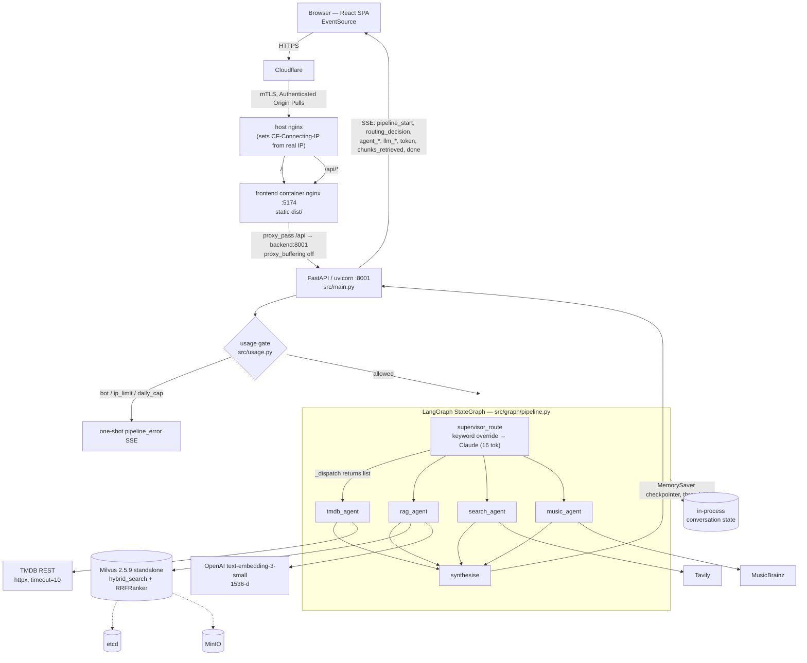

# CineAI / SmartMovieSearch — Architecture Deep Dive

> **Purpose:** an interview-grade, code-verified description of this system. Every claim below was
> checked against the implementation, not the marketing docs. Where the docs and the code disagree,
> the code wins and the disagreement is called out. Where a number is not measured, it says so.
>
> Scope: `cineai/backend` (FastAPI + LangGraph + Milvus), `cineai/frontend` (React SSE client),
> `cineai/docker-compose.yml` + ops scripts. Verified as of the current tree.

---

## 1. The 60-second pitch

> "SmartMovieSearch is a production agentic-RAG service that answers natural-language movie, TV and
> music questions that a filter UI can't — 'good bank heist movies', 'did Ebert like Blade Runner'.
> A LangGraph supervisor node classifies each question into one of ten routing decisions, then
> conditionally fans out to up to four specialist agents in parallel: a TMDB agent over the live
> movie API, a RAG agent doing hybrid BM25 + dense retrieval in Milvus over a corpus of curated
> essays plus scraped Roger Ebert reviews, a MusicBrainz agent, and a Tavily web-search agent. A
> synthesiser node merges their outputs into one grounded answer, streamed to the browser token by
> token over SSE alongside a typed event protocol that drives a live pipeline visualisation. It runs
> on a single VPS under Docker Compose behind nginx and Cloudflare, with per-IP quotas and a daily
> token kill-switch protecting a paid Anthropic key on an open, no-login endpoint."

**What's genuinely hard about it.** Three things, in order. (a) **Routing under ambiguity** — the
same sentence ("tell me about Heat") is a database lookup, a criticism question, or both, and the
router is a 16-max-token LLM call whose output is a bare string; getting that reliable required
deterministic keyword overrides *before* the LLM and a tolerant parser *after* it. (b) **Streaming
observability through a fan-out** — the frontend renders a live graph, a Gantt timeline and a token
stream, which means the backend must translate LangGraph's `astream_events` firehose into a stable,
typed SSE contract while several agents emit interleaved LLM tokens concurrently. (c) **Running a
paid LLM on an open endpoint** — no login, so the entire defence against financial DoS is layered
quotas, a global daily call cap, a token hard-cap kill-switch, and origin lock-down via Cloudflare
mTLS. Retrieval quality, by contrast, is the *least* solved part of the system (see §10).

---

## 2. System diagram



---

## 3. Request lifecycle, traced

Query: **"Show me good bank heist movies"**, `thread_id=t-123`.

1. **`GET /api/query?q=...&thread_id=t-123`** → `main.py:298 query_stream`. Three gates run before
   any LLM spend:
   - `_looks_like_bot(request)` (`main.py:85`) — rejects empty or library User-Agents
     (`curl`, `python-requests`, `headless`, …) and foreign `Origin`/`Referer`. Absent
     Origin/Referer is *allowed* — `EventSource` and privacy browsers omit it.
   - `usage.over_hard_cap()` (`usage.py:155`) — the `DAILY_TOKEN_HARD_CAP` kill-switch.
   - `usage.consume(request)` (`usage.py:201`) — blacklist → unlimited-token bypass → per-IP
     rolling window (`FREE_LIMIT=10` per `WINDOW_SECONDS=3600`) → site-wide
     `GLOBAL_DAILY_CALL_CAP=30`.

   Client identity comes from `usage.client_ip` (`usage.py:87`): `CF-Connecting-IP` first, then the
   first hop of `X-Forwarded-For`, then the socket peer. This is the documented gotcha — the
   *frontend container's* nginx clobbers `X-Real-IP` with the Docker gateway address, so
   `X-Real-IP` is worthless. `frontend/nginx-frontend.conf` explicitly re-forwards
   `CF-Connecting-IP: $http_cf_connecting_ip`, and the host nginx overwrites that header from the
   real-IP-resolved `$remote_addr` so a client can't spoof it.

2. **`StreamingResponse(_stream_pipeline(...), media_type="text/event-stream")`** with
   `_SSE_HEADERS = {"Cache-Control": "no-cache", "X-Accel-Buffering": "no"}` (`main.py:57`). Note:
   `sse-starlette` is in `requirements.txt` but is *not used* — SSE frames are hand-formatted by
   `_sse()` (`main.py:102`): `event: <type>\ndata: <json>\n\n`, with a `ts` millisecond stamp
   injected into every payload.

3. **`_stream_pipeline`** (`main.py:107`) builds the compiled graph (`build_pipeline()`, memoised
   with `lru_cache(maxsize=1)`), reads prior turns out of the checkpointer via
   `pipeline.get_state(config)`, and seeds `initial_state = {"question": ..., "history": [...]}`.
   Emits `pipeline_start`. Then iterates `pipeline.astream_events(initial_state, config, version="v2")`.

4. **`supervisor_route`** (`agents/supervisor.py:96`). `_keyword_route()` runs first: if the question
   contains any of `_FORCE_MUSIC_KEYWORDS` ("lyrics", "discography", "album", …) or
   `_FORCE_TMDB_KEYWORDS` ("box office", "rotten tomatoes", …) the LLM is skipped entirely. Here it
   doesn't match, so the last three history turns are formatted into the system prompt and a Claude
   call with `temperature=0, max_tokens=16` returns e.g. `"all"`.
   **State mutation:** `{"routing": "all"}`.

5. **Conditional fan-out.** `_dispatch` (`pipeline.py:49`) maps the routing string through a literal
   dict to a *list* of node names; `"all"` → `["tmdb_agent", "rag_agent", "search_agent",
   "music_agent"]`. LangGraph's `add_conditional_edges` treats a returned list as parallel activation
   — all four run in the same superstep, concurrently on one event loop. Unknown routing falls back
   to `["tmdb_agent"]`.

6. **`rag_agent`** (`agents/rag_agent.py:29`) → `tools/milvus_retriever.retrieve(question)`.
   Embeds the query (`aembed_query`, 1536-d), checks `_has_hybrid_schema()`, then issues two
   `AnnSearchRequest`s and fuses with `RRFRanker`. Returns `{rag_result, _rag_chunks}`.
   **`tmdb_agent`** (`agents/tmdb_agent.py:103`) makes *two* LLM calls: intent extraction
   (`max_tokens=256`, JSON) then a grounded answer (`max_tokens=1024`, or 1500 for
   `title_and_person`), with the TMDB payload truncated to 6000/9000 chars.
   **`music_agent`** likewise: extract (128 tok) → MusicBrainz → answer (1024 tok).
   **`search_agent`** hits Tavily and degrades to a literal "not available" string if
   `TAVILY_API_KEY` is unset.

7. **Superstep join.** Every agent node has an unconditional edge to `synthesise`
   (`pipeline.py:99-100`), so LangGraph waits for all active branches before running it.
   **`synthesise`** (`agents/synthesiser.py:46`) assembles `### TMDB Agent` / `### Music Agent` /
   `### RAG Knowledge Base` / `### Web Search` sections and makes one streaming Claude call
   (`temperature=0.2, max_tokens=1200`). **State mutation:** `{"answer": ..., "history": history + [{q, a}]}`
   truncated to the last 10 turns.

8. **Event translation** (`main.py:144-233`). The event loop maps:
   - `on_chain_start` / `on_chain_end` where `name ∈ _AGENT_NODES` → `agent_start` / `agent_end`
     (+ `routing_decision`, `chunks_retrieved`, `tmdb_results`, `music_results`).
   - `on_chat_model_start` / `on_chat_model_stream` / `on_chat_model_end` → `llm_start` / `token` /
     `llm_end`. **This is a load-bearing detail:** LangChain ≥1.0 emits `on_chat_model_*` for
     `BaseChatModel`; the legacy `on_llm_*` names only fire for text-completion `BaseLLM`. Listening
     for the wrong family silently kills streaming.
   - Token accounting reads `usage_metadata` as a **dict**, not via `getattr` — `usage_metadata` is
     a TypedDict at runtime, so `getattr(um, "input_tokens", 0)` silently returns 0
     (`main.py:218-226`). `stream_usage=True` in `llm.py:46` is what populates it on streamed calls.

9. **`done`** carries `total_latency_ms`, `total_prompt_tokens`, `total_completion_tokens`,
   `agents_used`. `usage.add_tokens(...)` records spend against the day and the IP — and it is
   called on the **error path too** (`main.py:237`), so a mid-stream failure still bills what it burned.

10. **Frontend** (`App.tsx:151 runQuery`). One `EventSource` per query; the access token rides in
    the URL as `?_t=` because `EventSource` cannot send custom headers (`api.ts makeSSEUrl`). Only
    `token` events with `is_final: true` (i.e. from `synthesise`) are appended to the visible answer;
    sub-agent tokens still arrive and land in the event log. `done` closes the stream and moves the
    answer into history. Pipeline errors arrive as **`pipeline_error`**, never `error` — `EventSource`
    reserves `error` for transport failures, so an application event named `error` is swallowed.

---

## 4. The agent layer

### Why supervisor-router, not ReAct or a tool-calling loop

The graph is a **two-hop DAG with no cycles**: `START → supervisor_route → {1..4 agents in
parallel} → synthesise → END` (`pipeline.py:86-102`). Deliberate consequences:

- **Bounded cost and latency.** Worst case (`all`) is exactly 8 LLM calls: supervisor 1, tmdb 2,
  music 2, rag 1, search 1, synthesise 1. A ReAct loop has no such bound — on an open, unauthenticated
  endpoint that's a financial-DoS vector, not just a latency concern.
- **Parallelism is free.** Four independent I/O-bound agents run in one superstep. A tool-calling
  loop is inherently sequential per step.
- **The routing decision is a first-class, inspectable artefact.** It is emitted as a
  `routing_decision` SSE event, drives the UI's pipeline graph, and the exact rules are served to the
  frontend by `GET /api/rules` (`main.py:552`) from the *same* constants the prompt is built from
  (`SUPERVISOR_LLM_RULE_BULLETS`, `_FORCE_MUSIC_KEYWORDS`, `_FORCE_TMDB_KEYWORDS`) — no drift between
  documented behaviour and actual behaviour.
- **Cost:** no self-correction. If retrieval returns junk, nothing re-queries. That is a real
  limitation, and the honest answer in an interview is "bounded-cost was worth more than
  self-correction for a public demo on a paid key."

### Routing signals, in priority order

1. **Deterministic keyword override** (`supervisor.py:86`) — wins unconditionally, skips the LLM.
   This exists because a 16-token classification from a small fast model mis-routed "who wrote the
   lyrics to Roxanne" to `tmdb`.
2. **History-aware LLM classification** — last 3 turns, each answer truncated to 150 chars, folded
   into the system prompt so follow-ups ("what about his other films?") stay coherent.
3. **Tolerant parsing** (`supervisor.py:124-132`) — exact match against a 10-member `valid` set;
   otherwise regex-extract `[a-z]+(\+[a-z]+)?` tokens, prefer the **longest** match (so `tmdb+rag`
   beats its own `tmdb` prefix), and fall back to `"tmdb+rag"`.
4. **`_dispatch`'s own fallback** to `["tmdb_agent"]` for anything unmapped.

### State schema and reducers — and why there aren't any

```python
class CineState(TypedDict, total=False):        # pipeline.py:36
    question: str
    history: list[dict]        # [{"q": ..., "a": ...}] — last 10 turns
    routing: str
    tmdb_result: str
    rag_result: str
    search_result: str
    music_result: str
    answer: str
```

There are **no `Annotated[..., reducer]` channels.** This is safe *by construction*, and it's worth
being able to say why: LangGraph raises `InvalidUpdateError` when two nodes in the same superstep
write the same channel without a reducer. Here each parallel agent writes a **disjoint** key
(`tmdb_result`, `rag_result`, `search_result`, `music_result`), and `history` is written only by
`synthesise`, which runs alone in a later superstep. Adding a fifth agent that also wrote
`rag_result`, or making two nodes append to `history`, would immediately require
`Annotated[list, operator.add]`.

**Private/undeclared keys.** Agents also return `_rag_chunks`, `_tmdb_raw`, `_music_raw`,
`_search_results` — none of which are declared in `CineState`. `main.py` reads them out of the
**event payload** (`data["output"]` on `on_chain_end`), not out of persisted state, so they function
as a side-channel for UI telemetry. It works, but it's an undocumented dependency on
`astream_events` shape; declaring them in the schema (or a separate output schema) would be cleaner.

### Checkpointing

`MemorySaver()` behind `lru_cache(maxsize=1)` (`pipeline.py:69`), passed to `g.compile(checkpointer=...)`.
Conversation state is keyed by `configurable.thread_id`. Honest characterisation: this is an
**in-process, in-memory** checkpointer. History does not survive a container restart, is not shared
across uvicorn workers, and grows unboundedly in RAM (bounded per thread at 10 turns by the
synthesiser, but unbounded in *number of threads*). `DELETE /api/history` works around
`MemorySaver`'s lack of a delete API by writing `{"history": [], "answer": ""}` via
`aupdate_state` (`main.py:378`).

### Failure and fallback paths

| Failure | Behaviour | Where |
|---|---|---|
| Milvus returns nothing | `rag_agent` short-circuits — **no LLM call** — and returns "The knowledge base does not contain relevant information for this query." | `rag_agent.py:36` |
| TMDB search empty | Hard stop, no LLM call, explicit "couldn't find '<query>'" string | `tmdb_agent.py:211` |
| TMDB discover empty | Same pattern | `tmdb_agent.py:150` |
| MusicBrainz artist not found | Same pattern | `music_agent.py:97` |
| No Tavily key / Tavily throws | `web_search` returns a formatted "unavailable"/"failed" string; agent detects it and degrades | `web_search.py:17,53` |
| Intent JSON unparseable | Caught, logged to stdout, falls back to `search_title` with the raw question | `tmdb_agent.py:114`, `music_agent.py:77` |
| **All** agents produce nothing | `synthesise` skips the LLM entirely and returns a canned apology | `synthesiser.py:61` |
| Any exception inside the graph | Caught in `_stream_pipeline`, classified into `rate_limit` / `auth_error` / `connection_error` / generic, **sanitised** of `org_*`/`user_*`/`proj_*` identifiers, emitted as `pipeline_error` | `main.py:235-284` |

Note the recurring pattern: *empty upstream data never reaches the LLM.* That's the primary
anti-hallucination control, reinforced by the synthesiser's CRITICAL instruction not to fill gaps
from memory when an agent reports "couldn't find". **There are no retries anywhere** — not on
Anthropic calls, not on TMDB, not on Milvus. A single 429 or transient 500 ends the request.

**Loop/recursion limits:** none configured. The graph is acyclic and at most 3 supersteps deep, so
LangGraph's default `recursion_limit` (25) is never approached. Correct answer in an interview:
"recursion limit is not a live concern in this topology; it would become one the moment I added a
re-retrieval or critique edge."

---

## 5. The retrieval layer

### Corpus

Two very differently-shaped halves in **one** Milvus collection:

- **Curated markdown** — 37 files under `backend/docs/` (~348 KB): directors (Nolan, Kubrick,
  Scorsese, Fincher, PTA, Villeneuve, Coppola, Tarantino, Spielberg, Wes Anderson), genres, decades,
  themes, international (Korean cinema, French New Wave), prestige TV, and a music sub-corpus
  (artists, genres, iconic albums, music-in-film). Ingested by `scripts/ingest.py`, `source` =
  file path (`docs/...`).
- **Roger Ebert reviews** — scraped from the Wayback Machine by `scripts/scrape_ebert.py`, stored as
  `data/ebert_reviews.jsonl` (gitignored), ingested by `scripts/ingest_ebert.py` with `source` =
  `ebert/<slug>`. `/api/knowledge` reports these two halves separately precisely because listing
  tens of thousands of reviews individually would be useless (`main.py:486`).

The corpus is **37 markdown files** under `backend/docs/` plus the separately-ingested Ebert
review corpus. Chunk counts are deliberately not recorded in prose (they change on every
re-ingest and after each nightly Ebert run) — read the live number with
`client.query(..., output_fields=["count(*)"])`.

### Chunking

`RecursiveCharacterTextSplitter`, separators `["\n\n", "\n", ". ", " ", ""]`:

| Corpus | chunk_size | overlap | Where |
|---|---|---|---|
| Markdown docs | 800 | 100 | `ingest.py:46-47` |
| Ebert reviews | 900 | 120 | `ingest_ebert.py:31-32` |

Reviews get a synthesised header before splitting so the first chunk carries provenance:
`"Roger Ebert Review: {title} ({year})\nRating: {stars}/4 stars\nSource: rogerebert.com"`
(`ingest_ebert.py:45`). Chunks are hard-truncated at `TEXT_MAX_LEN = 8192` to fit the VARCHAR field.

### Embeddings

OpenAI **`text-embedding-3-small`**, 1536-d (`config.py:35`, `milvus_retriever.py:22`).
Chosen for cost (~$0.02/1M tokens) — embedding tens of thousands of reviews is the only
non-trivial embedding bill in the system. OpenAI is the **only** embedding backend implemented:
there is no provider switch, and the collection's dense field is fixed at 1536 dimensions, so
changing embedder means a schema change and a full re-ingest.

### Collection schema and index config

```python
# scripts/ingest.py:82-111
schema = MilvusClient.create_schema(auto_id=True, enable_dynamic_field=False)
schema.add_field("id",            DataType.INT64,        is_primary=True)
schema.add_field("text",          DataType.VARCHAR,      max_length=8192, enable_analyzer=True)
schema.add_field("sparse_vector", DataType.SPARSE_FLOAT_VECTOR)
schema.add_field("dense_vector",  DataType.FLOAT_VECTOR, dim=1536)
schema.add_field("source",        DataType.VARCHAR,      max_length=512)

schema.add_function(Function(name="bm25", input_field_names=["text"],
                             output_field_names=["sparse_vector"],
                             function_type=FunctionType.BM25))

index_params.add_index("dense_vector",  index_type="IVF_FLAT",
                       metric_type="IP",   params={"nlist": 128})
index_params.add_index("sparse_vector", index_type="SPARSE_INVERTED_INDEX",
                       metric_type="BM25", params={"bm25_k1": 1.2, "bm25_b": 0.75})
```

Points to be able to defend:

- **`enable_analyzer=True` + a BM25 `Function`** means Milvus tokenises `text` server-side and
  *generates* `sparse_vector` on insert. The ingest path never computes sparse vectors — note that
  `embed_and_insert` inserts only `text`, `dense_vector`, `source` (`ingest.py:166`). Query side
  passes **raw query text** to the sparse `AnnSearchRequest`, not a vector.
- **IVF_FLAT, not HNSW.** `nlist=128`, searched with `nprobe=10` — i.e. ~8% of clusters probed.
  IVF_FLAT keeps full-precision vectors (no quantisation loss) and builds fast; HNSW would give
  better latency/recall at this scale but costs more memory and build time. At the current corpus
  size this is not the bottleneck. Be honest that the params are defaults, not tuned against a recall
  measurement.
- **Metric `IP` (inner product).** OpenAI embeddings are L2-normalised, so IP is equivalent to cosine
  similarity — a common interview follow-up.
- **BM25 k1=1.2, b=0.75** — the standard Robertson/Sparck-Jones defaults; untuned.

### Hybrid search and fusion math

```python
# src/tools/milvus_retriever.py:64-86
dense_req  = AnnSearchRequest(data=[dense_vec], anns_field="dense_vector",
                              param={"metric_type": "IP", "params": {"nprobe": 10}}, limit=k)
sparse_req = AnnSearchRequest(data=[query],     anns_field="sparse_vector",
                              param={"metric_type": "BM25"}, limit=k)
raw = client.hybrid_search(collection_name=cfg.milvus_collection,
                           reqs=[dense_req, sparse_req],
                           ranker=RRFRanker(k=cfg.hybrid_rrf_k),   # k = 60
                           limit=k, output_fields=["text", "source"])
```

**Reciprocal Rank Fusion:** each document's fused score is `Σ_i 1/(k + rank_i)` over the lists it
appears in, with `rank` 1-based and `k = HYBRID_RRF_K = 60` (`config.py:36`). RRF is *rank*-based,
not score-based — which is exactly why it's the right choice here: BM25 scores and inner-product
similarities live on incompatible scales, and normalising them would require calibration data this
system doesn't have. Larger `k` flattens the curve (more recall, weaker top-rank dominance); smaller
`k` sharpens precision. With `k=60` and `top_k=6`, a rank-1 hit contributes `1/61 ≈ 0.0164` and a
rank-6 hit `1/66 ≈ 0.0152` — only a ~8% spread, so a document that appears in *both* lists almost
always outranks one that dominates a single list. That's the intended behaviour.

`top_k` defaults to **6** (`config.py:30`, now read from the `TOP_K` env var). Note this is a
single global k — there is no per-route or per-query-type k, so a broad "compare these five
directors" question retrieves the same six chunks as a narrow factual lookup.

The retrieved chunks are joined into one context block with `[Source: {source}]` headers and
`\n\n---\n\n` separators (`milvus_retriever.py:112`), then dropped into the RAG agent's system prompt.

### Fallback path

`_has_hybrid_schema()` (`milvus_retriever.py:34`) calls `describe_collection` and checks for a
`sparse_vector` field; if absent, retrieval degrades silently to dense-only `client.search`. The
`search_type` (`"hybrid"` / `"dense"`) is propagated all the way into the `chunks_retrieved` SSE
event and rendered as a badge in the UI. **Inefficiency worth naming:** `describe_collection` is an
RPC issued on *every single query* with no caching, unlike the client and embedder which are both
`lru_cache`d.

### Honest failure modes

- **No reranker.** No cross-encoder, no Cohere/Voyage rerank stage. Top-6 RRF results go straight
  into the prompt. This is the single highest-leverage retrieval improvement available.
- **No metadata filtering at query time.** The retriever never passes a Milvus `filter=` expression.
  "What did Ebert say about X" cannot restrict to `source like "ebert/%"`; it relies on BM25 matching
  the word "Ebert" that happens to be in the synthesised review header. Filtering exists only in
  `/api/knowledge` for counting.
- **No partitions.** Curated essays and tens of thousands of reviews share one flat collection, so
  the review corpus can numerically swamp the 37 curated docs for generic queries. This is the most
  likely cause of "why did my Nolan question return three random 1997 review chunks."
- **No query rewriting / HyDE / multi-query.** The raw user question is embedded verbatim. Follow-up
  questions ("what about his other films?") are given history for *routing* but the RAG query itself
  has no coreference resolution — so retrieval for follow-ups is materially worse than for
  standalone questions.
- **No dedup at retrieval time.** Overlapping chunks from the same document can occupy several of
  the 6 slots.
- **Insert-only, no upsert.** `auto_id=True` with plain `client.insert`; re-running `ingest.py`
  without `--reset` **appends duplicates**. The Ebert path avoids this with an application-level
  guard: `norm_slug()` (`ingest_ebert.py:36`) collapses `ebert/amp/foo` and `ebert/foo` to one key,
  and `--skip-existing` paginates the existing `source` values with `query_iterator(batch_size=16000)`
  because Milvus caps a single query window at 16,384 rows. That's a real, specific war story: the
  AMP mirror pages were producing duplicate copies of every review until the slug normalisation
  landed.

---

## 6. The LLM layer

### Model routing — what it actually is

```python
# src/llm.py:20-24
MODELS = {"haiku":  "claude-haiku-4-5",
          "sonnet": "claude-sonnet-4-6",
          "opus":   "claude-opus-4-8"}
```

**There is no per-node model routing.** A single server-wide tier (`DEFAULT_MODEL_TIER`, default
`haiku`) selects the model for *every* call — supervisor, agents, synthesiser, judge. What varies
per node is `temperature`, `max_tokens`, and `streaming`:

| Node | temperature | max_tokens | streaming | Source |
|---|---|---|---|---|
| `supervisor_route` | 0 | 16 | no | `supervisor.py:69` |
| `tmdb_agent` intent | 0.1 | 256 | yes | `tmdb_agent.py:106` |
| `tmdb_agent` answer | 0.1 | 1024 (1500 for `title_and_person`) | yes | `tmdb_agent.py:228` |
| `music_agent` intent | 0.1 | 128 | yes | `music_agent.py:70` |
| `music_agent` answer | 0.1 | 1024 | yes | `music_agent.py:112` |
| `rag_agent` | 0.1 | 900 | yes | `rag_agent.py:26` |
| `search_agent` | 0.1 | 800 | yes | `search_agent.py:25` |
| `synthesise` | 0.2 | 1200 | yes | `synthesiser.py:43` |
| compare sides / judge | 0.1 | 900 / 400 | yes | `compare.py:70,185` |

One genuinely non-obvious detail worth mentioning unprompted: **`get_chat` omits `temperature`
entirely for the opus tier** because Opus 4.8/4.7 reject sampling parameters with a 400
(`llm.py:48`). That's the kind of provider-specific sharp edge that signals you actually shipped
against the API.

`max_tokens=16` on the router is a deliberate cost/latency control — the router is called on
essentially every request and its entire output is one token like `"tmdb+rag"`.

### The `parse_llm_json` story (tell this one in interviews)

TMDB title lookups quietly degraded for weeks. Symptom: users asked "What is Inception about?" and
got a generic non-answer. No exception, no error log, no alert.

Root cause: `tmdb_agent` asks Claude for an intent object with "Respond with JSON only (no markdown,
no explanation)". Claude frequently honours the *content* of that instruction while wrapping the
result in a ```json fence. `json.loads()` on the fenced string raises `JSONDecodeError`, which was
caught by a bare `except` whose fallback was `{"search_type": "search_title", "query": question}` —
i.e. search TMDB for the *entire raw sentence*. `/search/multi?query=What is Inception about?`
returns nothing. Empty results → the agent's hard-stop "couldn't find it" path → a plausible,
useless answer. **The failure was invisible because the fallback was valid code.**

The fix (`llm.py:53`) is three-layered and now mandatory project-wide:

```python
def parse_llm_json(text: str) -> dict:
    text = text.strip()
    fenced = re.search(r"```(?:json)?\s*(\{.*?\})\s*```", text, re.S)
    if fenced:
        text = fenced.group(1)
    try:
        return json.loads(text)
    except json.JSONDecodeError:
        brace = re.search(r"\{.*\}", text, re.S)
        if brace:
            return json.loads(brace.group(0))
        raise ValueError(f"no JSON object in LLM reply: {text[:120]!r}")
```

Strip fences → parse → fall back to the first `{...}` block → **raise** rather than return a
degraded default. Call sites still catch, but now they `print` the offending reply
(`tmdb_agent.py:119`, `music_agent.py:80`) so a regression surfaces in `docker compose logs backend`.
The lesson to articulate: *silent fallbacks in LLM plumbing are worse than crashes, because a
degraded answer looks like a working system.* The project rule ("never bare `json.loads` on LLM
output") is codified in `CLAUDE.md`.

### Prompt structure

Every agent uses the same shape: a `SystemMessage` carrying instructions **plus** the retrieved
data interpolated into the template, and a `HumanMessage` carrying the bare user question. Grounding
is enforced by prompt discipline: "using ONLY the context documents provided", explicit
`CRITICAL — never hallucinate` blocks in the TMDB and music agents, an anti-media-type-confusion
block ("media_type 'tv' means it is a TV series, NOT a movie"), and link-format instructions that
force TMDB/MusicBrainz URLs to be built from returned `id` fields. The synthesiser adds
`PRESERVE all markdown links` so it doesn't strip the citations its sub-agents produced.

Raw API payloads are truncated before interpolation — `tmdb_text[:6000]` (or 9000 for
`title_and_person`), `music_text[:6000]`, `formatted[:5000]` for Tavily — a crude but effective
prompt-budget control.

### Token and cost characteristics

Per `llm.py:8`: haiku $1/$5 per 1M in/out, sonnet $3/$15, opus $5/$25. Call counts per route:
`tmdb` = 3 (router + extract + answer), `rag` = 3, `music` = 4, `all` = 8. Actual token totals are
measured per request from `usage_metadata` and reported in the `done` event and in
`/api/usage` / `/api/admin/usage`, aggregated per-day and per-IP in memory (`usage.py:132`).
**There is no cost dashboard, no historical token series, and no per-route cost breakdown** — the
counters reset on restart and on UTC midnight.

### Streaming

`streaming=True` + `stream_usage=True` on the `ChatAnthropic` instance; LangGraph surfaces chunks as
`on_chat_model_stream`; `main.py` re-emits them as `token` events tagged with `is_final`, which is
`True` only while the current node is `synthesise` (`main.py:151`). The frontend renders only
`is_final` tokens into the answer pane. **Known race:** `current_agent` is a single scalar updated
on every `on_chain_start`, so during the parallel fan-out the `agent` label attached to a `token` or
`llm_end` event can be attributed to whichever agent started most recently — token *totals* are
correct (they're summed globally) but per-agent attribution during fan-out is not reliable.

### The compare / blind-judge mode

`src/compare.py` is a separate, non-LangGraph stream: it retrieves once, runs the same model with and
without the retrieved context **concurrently** (two `asyncio` tasks multiplexed through an
`asyncio.Queue` with a `None` sentinel per side), then makes a third call — a blind judge that
receives both answers in random A/B order (`random.choice`) and is explicitly *not* told which used
retrieval. The mapping is revealed to the UI only after the verdict. It emits both its own
`compare_*` events and the standard pipeline events so the observability panel keeps working. This
is the closest thing the project has to an eval — but it's a **single-sample, LLM-judged, non-recorded
demo**, not a measurement (see §10).

---

## 7. Serving and infrastructure

### API surface (`src/main.py`)

| Endpoint | Auth | Notes |
|---|---|---|
| `GET /api/query?q&thread_id` | quota-gated | SSE pipeline stream |
| `GET /api/compare?q` | quota-gated | SSE RAG-vs-no-RAG + blind judge; costs 1 credit for ~3 calls |
| `GET /api/usage` | public | quota + daily token snapshot |
| `GET /api/status` | public | Milvus / Anthropic / TMDB liveness + key-presence booleans |
| `GET /api/knowledge` | public | corpus summary via Milvus `count(*)` + `query_iterator` |
| `GET /api/rules` | public | routing rules, generated from supervisor constants |
| `GET /api/trending`, `GET /api/search` | public | thin TMDB passthroughs |
| `GET`/`DELETE /api/history` | **admin token** | tightened per SEC-4 |
| `GET /api/admin/usage`, `POST /api/admin/blacklist` | **admin token** | per-IP table, blacklist CRUD |
| `POST /api/auth` | public | password → token; 5 fails / 15 min lockout per IP |
| `GET /api/health` | public | container healthcheck target |

Auth is a shared preview password; the token is `sha256("sms-gate:" + PREVIEW_PASSWORD)`
(`usage.py:27`) compared for exact equality, and `is_unlimited` returns `False` outright when no
password is configured so a blank config can't accidentally grant unlimited access.

### Concurrency model

Fully async FastAPI on **one uvicorn process, one event loop** (`backend/Dockerfile` CMD has no
`--workers`). Everything in `usage.py` is process-local module state behind a `threading.Lock`.
Two consequences to state plainly:

1. **Quotas, token counters, the rate-limit flag and the conversation checkpointer are all
   single-process.** Scaling to `--workers 4` today would multiply every quota by 4 and shard
   conversation history randomly across workers.
2. **Two blocking calls sit on the event loop.** `pymilvus`'s `client.hybrid_search` /
   `client.search` / `client.describe_collection` are synchronous gRPC calls invoked from
   `async def retrieve` (`milvus_retriever.py:79`), and `web_search` instantiates a **synchronous**
   `TavilyClient` and calls `client.search(...)` inside an `async def` (`web_search.py:29-34`).
   Neither is wrapped in `run_in_executor`/`asyncio.to_thread`. Under concurrency these stall *all*
   in-flight SSE streams, not just their own. This is the first thing to fix before any load test.

### Deployment topology

`cineai/docker-compose.yml` — 6 services:

| Service | Image | Published port | Note |
|---|---|---|---|
| `etcd` | `quay.io/coreos/etcd:v3.5.18` | — | Milvus metadata |
| `minio` | `minio/minio:RELEASE.2023-03-13...` | — | Milvus object storage |
| `milvus` | `milvusdb/milvus:v2.5.9` | `127.0.0.1:19530`, `127.0.0.1:9091` | **standalone** mode |
| `attu` | `zilliz/attu:v2.4` | `127.0.0.1:5160` | admin UI, **no auth** — hence loopback + SSH tunnel |
| `backend` | built from `./backend` | `127.0.0.1:8001` | uvicorn |
| `frontend` | multi-stage node:22 → nginx:alpine | `127.0.0.1:5174` | serves `dist/` + proxies `/api` |

Every published port is bound to `127.0.0.1` — the fix for SEC-2, since Docker's iptables rules
bypass ufw. All services `restart: unless-stopped` with json-file logging capped at 10 MB × 3.
Milvus/etcd/minio have healthchecks; `backend` depends on `milvus: service_healthy`.

**Two nginx layers.** The frontend container's nginx proxies `/api/` → `backend:8001` with
`proxy_buffering off`, `proxy_read_timeout 600s`, and the `CF-Connecting-IP` re-forward. The *host*
nginx (not fully represented by the repo's `nginx.conf`) terminates Cloudflare traffic. Per
`SECURITY-AUDIT.md`, the live host config was moved to **443 + Cloudflare Origin cert + Authenticated
Origin Pulls (`ssl_verify_client on`)**, so only Cloudflare can reach the origin and `CF-Connecting-IP`
is overwritten from the verified `$remote_addr`. The checked-in `nginx.conf` still describes the
older port-80 / CF-Flexible arrangement — treat it as reference, not truth.

### Ops

- **`nightly_update.sh`** — `flock`-guarded single-instance cron job: `scrape_ebert.py
  --refresh-recent 1 --limit 800` then `ingest_ebert.py --skip-existing`; emails a summary only when
  chunks were actually added; prunes logs older than 30 days.
- **`backup.sh`** — tars `backend/.env` + `backend/data/` and pipes through **`age`** encryption;
  *refuses to run* without `BACKUP_AGE_RECIPIENT`. Explicitly does **not** back up Milvus, on the
  correct reasoning that the vector DB is derived data reconstructible from the JSONL.
- **`devops_check.py`** — nightly: container state/health/restart counts, `/api/health`, disk %,
  `MemAvailable`, reclaimable Docker space, backup freshness (>36 h = issue), **origin-cert expiry
  (<30 days = issue)**, and last nightly-ingest result. Writes a per-run report plus an append-only
  `devops-history.jsonl`, keeps the last 60, emails red/green.
- **Tests:** `make test-unit` → pytest over `src/usage.py` (quotas, caps, blacklist, lockout — 268
  lines, no Docker or API keys needed). `make test-e2e` → Playwright/Chromium against the running
  stack: homepage, trending cards, a real SSE search (costs a credit and real tokens), usage
  accounting, modals, theme, and a dedicated case asserting the anti-bot guard rejects headless UAs.
  **There are zero tests for the graph, the agents, the router, or retrieval.**

---

## 8. Design tradeoffs

| Decision | Chosen | Alternatives | Why | What it costs |
|---|---|---|---|---|
| Orchestration | LangGraph `StateGraph`, compiled DAG | LCEL chains; raw `asyncio.gather`; CrewAI/AutoGen | Explicit typed state, conditional fan-out, checkpointed multi-turn, and `astream_events` gives the SSE protocol for free | Framework lock-in; `astream_events` shape is an undocumented dependency; heavy for a 6-node graph |
| Agent topology | Supervisor-router → parallel specialists → synthesiser | ReAct loop; single agent with tool-calling | Bounded ≤8 LLM calls, parallel I/O, inspectable routing decision | No self-correction, no re-retrieval, no tool chaining |
| Routing | Keyword override, then LLM classifier, then tolerant parse | Pure LLM; embedding classifier; fine-tuned model | Deterministic for high-signal words; cheap (16 output tokens); rules are served to the UI from the same constants | Keyword list is hand-maintained; no measured routing accuracy |
| LLM | Anthropic Claude via `langchain_anthropic`, one global tier | Per-node tiering; Groq/OSS; OpenAI | One env var flips the whole app; consistent instruction-following for the grounding rules | Router pays the same model as synthesis; can't use a cheap model for classification and a strong one for synthesis |
| Vector DB | Milvus 2.5 standalone | Chroma, pgvector, Pinecone, Qdrant | Native BM25 `Function` + `hybrid_search` + `RRFRanker` server-side; same API scales to distributed | 3 extra containers (etcd, MinIO, Milvus) on a small VPS; heaviest dependency in the stack |
| Retrieval | Hybrid BM25 + dense, RRF k=60 | Dense-only; BM25-only; weighted score fusion | Dense alone misses exact titles/proper nouns; RRF needs no score calibration across incompatible scales | Two ANN searches per query; k is untuned; no reranker |
| Dense index | IVF_FLAT, nlist=128, IP, nprobe=10 | HNSW (M/efConstruction/efSearch); IVF_PQ | Full precision, fast build, adequate at this corpus size | Worse latency/recall curve than HNSW at scale; params are defaults, not measured |
| Embeddings | OpenAI `text-embedding-3-small` (1536-d) | `-3-large` (3072-d); bge/E5 local; Ollama nomic | Cheapest credible quality; re-embedding a large review corpus is the main embedding cost | External dependency + key for what could be local; documented Ollama path doesn't exist in code |
| Transport | SSE via hand-rolled `StreamingResponse` | WebSocket; long-poll; `sse-starlette` | Unidirectional fits exactly; `EventSource` auto-reconnects; passes Cloudflare with buffering off | No client→server channel (can't cancel a run server-side); token must ride in the URL |
| Checkpointer | `MemorySaver` | `SqliteSaver`, `PostgresSaver`, Redis | Zero infra, trivial multi-turn | History lost on restart; blocks horizontal scaling; unbounded thread growth |
| Abuse control | Per-IP window + global daily cap + token kill-switch + bot heuristic | Login/OAuth; Cloudflare Turnstile; API keys | Keeps the demo genuinely open while capping a paid key | In-memory (single-process); UA heuristic is trivially spoofable; caps make the site refuse real users after 30 searches/day |
| Corpus refresh | Nightly Wayback scrape + `--skip-existing` ingest | Bulk one-shot; a real ETL orchestrator | Idempotent, resumable, ~90 lines of bash | No Airflow/Dagster; failures only surface via email; no data-quality checks |

---

## 9. Scaling and failure analysis

### What breaks first, in order

1. **The single uvicorn worker + blocking calls.** Concurrent SSE streams share one event loop, and
   `pymilvus` and Tavily calls block it. The first real symptom of load is unrelated users' token
   streams stalling in lockstep. **Fix order:** wrap blocking calls in `asyncio.to_thread`, then move
   quota/checkpoint state to Redis, then run multiple workers.
2. **`MemorySaver`.** The moment you add a second worker or restart the container, multi-turn
   conversations break. Swap for `PostgresSaver`/`RedisSaver` — this is a config-level change,
   `pipeline.py:70` is the only place that constructs it.
3. **`usage.py` in-memory counters.** Per-IP windows, the day's token total, the global call counter
   and the auth-lockout map are all module globals. Any horizontal scaling multiplies every limit by
   the worker count. Redis with `INCR`/`EXPIRE` is the standard answer.
4. **Anthropic rate limits.** No retry, no backoff, no queue. One 429 kills the request and sets a
   5-minute in-memory warning flag. At 10× traffic this becomes the dominant error class. Needs
   `max_retries` with jittered backoff plus a request queue with an admission bound.
5. **Milvus standalone.** One node, one collection, ~1 GB-scale memory footprint on a shared VPS with
   etcd and MinIO next to it. `devops_check.py` already flags `MemAvailable < 0.4 G` — that is the
   canary. At 100× corpus, IVF_FLAT's flat storage becomes the constraint before query latency does.

### 10× traffic

Blocking I/O and the single worker dominate. Everything else (TMDB at 50 req/s free, Milvus at this
corpus size) has headroom. Estimated fix effort: a day for `to_thread` + Redis-backed quotas.

### 100× traffic

Requires: multi-worker or multi-replica backend behind the existing nginx; Redis for quotas,
checkpoints and a semantic cache (the roadmap's `RedisSemanticCache` at cosine 0.95 would remove a
large fraction of LLM calls on a demo site with repetitive queries); LLM concurrency limiting with a
real queue; and Anthropic capacity beyond the default tier.

### 100× corpus (millions of chunks)

- Switch dense index IVF_FLAT → **HNSW** (or IVF_PQ if memory-bound) and actually measure recall@k
  against a labelled set before/after.
- **Partition** by corpus type (`docs` vs `ebert`) or by decade, and pass partition/filter hints from
  the router so curated essays can't be swamped by review chunks.
- Move ingestion off the single-process script: batching is already there (`EMBED_BATCH=256`, with
  per-batch failure isolation), but there's no parallelism, no checkpoint of embedding progress, and
  no backfill/repair job.
- Add a reranking stage — at large corpora, top-6 from RRF without a cross-encoder is the dominant
  quality loss.

### Single points of failure

Single VPS; single Milvus node (etcd + MinIO both required for it to start); single uvicorn process;
in-memory conversation state; Anthropic as a hard dependency for every request including the
`/api/status` ping; OpenAI as a hard dependency for *every* RAG query (query embedding is not
cached). Cloudflare is a SPOF by design — with Authenticated Origin Pulls enforced, if Cloudflare is
down the origin refuses everything.

### With real headcount, first three things

1. Instrument: OpenTelemetry traces + a Prometheus/Grafana pair for per-node latency, per-route cost,
   error rates and retrieval hit-rate. **Right now there is no way to answer "what's your p95".**
2. Build an eval harness: 50–100 labelled Q/A pairs, RAGAS or equivalent (faithfulness, answer
   relevancy, context precision/recall), plus a routing-accuracy confusion matrix, run in CI.
3. Move state out of process (Redis/Postgres) and remove the blocking I/O.

---

## 10. Known gaps and honest weaknesses

Name these before an interviewer finds them.

- **No latency instrumentation. There is no measured p50/p95/p99.** The `done` event reports
  `total_latency_ms` for that one request to that one browser, and `agent_end` reports per-node
  latency — but nothing is aggregated, persisted, or alerted on. The whitepaper's "typically 3–6
  seconds" is an impression, not a measurement. *In an interview, say exactly this, then describe how
  you'd measure it: the SSE event stream already contains per-node timings, so shipping them to a
  time-series store is a small change.*
- **No retrieval quality metrics.** No RAGAS, no recall@k, no golden set, no A/B. `top_k=6`,
  `RRF k=60`, `nprobe=10`, `nlist=128`, `chunk_size=800/900` are all defaults or guesses. The
  compare-mode blind judge is a *demo*, not an eval — one sample, LLM-judged, results not recorded.
- **No routing accuracy measurement.** The keyword overrides and the "when in doubt prefer tmdb"
  tiebreaker were added in response to observed mis-routes, not to a measured confusion matrix.
- **Observability is optional and off by default.** LangSmith is wired only through env vars
  (`LANGCHAIN_TRACING_V2` defaults to `false` in `.env.example`); there is no tracing code in the
  repo. Errors go to stdout and Docker json-file logs. There is no structured logging, no error
  tracker, no metrics endpoint.
- **No retries or circuit breakers** on any external call.
- **Blocking I/O on the async event loop** — `pymilvus` (sync gRPC) and the sync `TavilyClient`.
- **`describe_collection` RPC on every query** instead of a cached schema check.
- **Test coverage is lopsided:** `usage.py` is well covered by pytest and the whole UI by Playwright;
  the graph, router, agents, `parse_llm_json` and the retriever have **no unit tests**.
- **Per-agent token/telemetry attribution is racy during fan-out** (single `current_agent` scalar).
- **Prompt injection is accepted risk** (SEC-6): user text plus RAG/Tavily/TMDB text all flow into
  Claude. The blast radius is genuinely small — the LLM has no tools, no secrets in context, and
  cannot execute anything — but the system does not sanitise or delimit untrusted content beyond
  prompt instructions.
- **Docs/code drift — found by this audit, now RESOLVED.** These were real and are recorded
  because the *pattern* is worth talking about in an interview, not because they still bite:
  - `HANDOFF.md` and `WHITEPAPER.md` described **Groq / `llama-3.3-70b-versatile`** throughout,
    including a "Why Groq?" design-decision section and Groq rate-limit runbooks, while the code
    was **100% Anthropic Claude** (`src/llm.py`, `src/config.py`, `requirements.txt` pins
    `langchain-anthropic`; no Groq import anywhere). The migration happened; the docs were never
    updated. **Fixed** — both documents now describe the Claude tier system, and the Groq
    free-tier runbook was replaced with the app's own quota model from `src/usage.py`.
  - `.env.example` documented `TOP_K` and `EMBEDDING_PROVIDER` that `config.py` never read.
    **Fixed** — `config.py` now reads `TOP_K` (default 6, so behaviour is unchanged), and the
    unimplemented Ollama-embedding option was removed from the docs rather than left as a
    promise the code does not keep.
  - `MILVUS_COLLECTION` default disagreed between `config.py` (`cineai_docs`) and `.env.example`
    (`smartmoviesearch_docs`). **Fixed** — `.env.example` now matches the code default.
  - The corpus count "17 docs / 168 chunks" was stale (37 markdown files plus the Ebert corpus).
    **Fixed** — replaced with the file count and an explicit note that chunk count is not tracked
    in docs because every re-ingest changes it.
  - The checked-in `nginx.conf` described port-80 / Cloudflare-Flexible — the exact posture that
    was finding SEC-1 — while the live origin is 443 + mTLS. **Fixed** — the file is now clearly
    marked historical/do-not-deploy, since deploying it would silently re-open SEC-1.
  - `frontend/src/types.ts` omitted `music_agent` from `AgentName` and the music routes from
    `RoutingDecision`, and `HANDOFF.md`'s state block omitted `music_result`. **Fixed** in both.

  The honest interview framing: this is what happens when documentation is written once at
  feature-completion time and never re-derived from the code. The durable fix is not "update the
  docs" — it is a check that fails when they diverge (assert the documented model IDs exist in
  `MODELS`, assert every env var in `.env.example` is read by `config.py`, assert `AgentName`
  matches the `_dispatch` mapping). That check does not exist yet.

---

## 11. Likely interview questions, with strong answers

**1. Why a supervisor-router instead of a ReAct agent?**
Cost and latency determinism on an open, unauthenticated endpoint. My worst case is exactly 8 LLM
calls and 3 supersteps; a ReAct loop's cost is unbounded, which on a paid key with no login is a
financial-DoS vector. I also get parallelism for free — four I/O-bound agents run in one superstep —
and the routing decision becomes an inspectable artefact I stream to the UI and serve from
`/api/rules`. The cost is no self-correction: if retrieval returns junk, nothing re-queries.

**2. Walk me through the state schema. Why no reducers?**
`CineState` is a `TypedDict(total=False)` with 8 keys. No `Annotated` reducers, and that's safe by
construction: LangGraph raises `InvalidUpdateError` when two nodes in the same superstep write the
same channel without one, and here every parallel agent writes a disjoint key while `history` is
written only by `synthesise` in a later superstep. The moment I added a second node that appended to
`history`, I'd need `Annotated[list, operator.add]`.

**3. How does the hybrid search actually work — what's the fusion math?**
Two `AnnSearchRequest`s against the same collection: dense against `dense_vector` (IVF_FLAT, IP,
nprobe=10) with the OpenAI query embedding, and sparse against `sparse_vector` with the **raw query
text** — Milvus tokenises it server-side because the field is generated by a BM25 `Function` over an
analyzer-enabled `text` field. `RRFRanker(k=60)` fuses them: `score = Σ_i 1/(60 + rank_i)`. It's
rank-based, not score-based, which is the point — BM25 scores and inner products aren't comparable
and I have no calibration data to normalise them.

**4. Why IVF_FLAT and not HNSW?**
Corpus size didn't justify HNSW's memory and build cost, and IVF_FLAT keeps full-precision vectors.
Honestly: `nlist=128`/`nprobe=10` are defaults, not tuned against a recall measurement. At 100× corpus
I'd switch to HNSW and tune `M`/`efConstruction`/`efSearch` against a labelled recall@k set — but I'd
build the eval set first, because tuning without measurement is theatre.

**5. Why inner product and not cosine or L2?**
OpenAI embeddings are L2-normalised, so IP is mathematically equivalent to cosine and skips the
normalisation step. It also has to match on both sides — index metric and search metric.

**6. What's your p95 latency and where does it go?**
I don't have one, and I won't invent it — there's no aggregation layer. What I can tell you is the
shape: the critical path for a multi-agent route is router (~16 output tokens) → the slowest agent →
synthesis (up to 1200 tokens), and since agents run in parallel the fan-out width doesn't add
serially. The TMDB agent is structurally the slowest because it makes two sequential LLM calls with
an API round-trip between them. The per-node timings are already in the `agent_end` SSE events;
shipping them to a time-series store is the smallest change that would let me answer this properly.

**7. How do you know retrieval is any good?**
I don't, quantitatively — that's the biggest gap. What exists is a blind LLM-judge compare mode: same
question answered with and without retrieved context, presented to a third call in random A/B order
with provenance withheld. It's a good demo of grounding, but it's single-sample and unrecorded. A
real answer needs a 50–100 pair golden set with RAGAS faithfulness / answer-relevancy / context-precision,
run in CI on every retriever change.

**8. Give me a query this system gets wrong, and why.**
"What did Ebert say about Nolan's use of practical effects?" — the retriever never passes a Milvus
`filter=`, so it can't restrict to `source like "ebert/%"`; it relies on BM25 matching the word
"Ebert" from the header I synthesise into each review chunk. And because tens of thousands of review
chunks share one flat collection with 37 curated essays, the review corpus can numerically swamp the
essays. Fix: partitions plus router-supplied metadata filters.

**9. A sub-agent returns nothing. What happens?**
It short-circuits before the LLM. `rag_agent` returns a fixed "knowledge base does not contain…"
string, `tmdb_agent` and `music_agent` return explicit "couldn't find X, check the spelling" strings,
`search_agent` returns "not available". The synthesiser has an explicit CRITICAL instruction: when
agent outputs say nothing was found, tell the user what wasn't found rather than filling the gap from
parametric memory. And if *no* agent produced anything, `synthesise` skips the LLM entirely. Not
calling the model on empty data is the primary hallucination control.

**10. Tell me about a bug that taught you something.**
The `parse_llm_json` one — see §6. Short version: Claude wrapped "JSON only" replies in ```json
fences, `json.loads` raised, a bare `except` fell back to searching TMDB for the entire raw sentence,
which returned nothing, which hit the "couldn't find it" path. No exception, no log, degraded answers
for weeks. The lesson isn't "strip fences" — it's that a silent fallback in LLM plumbing is worse
than a crash, because a degraded answer looks like a working system. It's now a hard project rule
with a shared helper that *raises*, and the call sites log the offending reply.

**11. Why SSE and not WebSockets?**
The data flow is strictly server→client. `EventSource` reconnects automatically, and SSE traverses
Cloudflare with only `proxy_buffering off` and Response Buffering off — WebSockets need extra CF
config and bidirectional overhead I don't use. Two costs I accept: `EventSource` can't set headers,
so the access token rides in the query string (logged by nginx — SEC-5, accepted); and there's no
client→server channel, so I can't cancel a running graph server-side.

**12. There's a subtle naming bug in the event protocol. What was it?**
`EventSource` reserves the `error` event for transport failures, so an application-level event named
`error` is swallowed by the connection handler and never reaches the app listener. Renamed to
`pipeline_error` on both ends.

**13. How do you handle rate limits and API failures?**
Poorly, honestly — that's a known gap. There are no retries anywhere. A 429 is caught in
`_stream_pipeline`, classified by string matching, the retry-after is regex-extracted, an in-memory
flag is set for 5 minutes so `/api/status` shows "rate limited" even though the 5-token status ping
still succeeds, and a typed `pipeline_error` goes to the UI as a banner. Error text is sanitised of
`org_*`/`user_*`/`proj_*` identifiers before it's sent to the browser. What's missing is
`max_retries` with jittered backoff and a circuit breaker.

**14. How do you stop someone draining your Anthropic budget?**
Four layers. Per-IP rolling window (10 per hour) keyed on `CF-Connecting-IP`; a site-wide
`GLOBAL_DAILY_CALL_CAP` of 30 anonymous searches per day; a `DAILY_TOKEN_HARD_CAP` kill-switch that
pauses anonymous LLM calls when the day's token total is reached; and a User-Agent/Referer bot
heuristic. Plus a file-backed IP blacklist and a 5-fail/15-minute auth lockout. The load-bearing
piece is at the edge though: those defences all key on a header, so the real fix was locking the
origin to Cloudflare with Authenticated Origin Pulls (mTLS, `ssl_verify_client on`) so nobody can
reach the origin directly and spoof `CF-Connecting-IP`.

**15. Why is `X-Real-IP` untrustworthy here?**
Two proxy hops. The frontend container's nginx sets `X-Real-IP` to `$remote_addr`, which by then is
the Docker gateway. So the only trustworthy identifiers are `CF-Connecting-IP` — which the host nginx
overwrites from the real-IP-resolved `$remote_addr` so a client can't forge it — and the first hop of
`X-Forwarded-For`. That's exactly the precedence in `usage.client_ip`.

**16. What's your prompt injection exposure?**
User text plus RAG chunks plus Tavily results plus TMDB fields all flow into the model. Blast radius
is output manipulation and token waste: the LLM has no tools, no privileged actions, no secrets in
context, and there's no user-controlled code or URL execution — so it can't escalate to RCE or data
exfiltration. That's the documented, accepted risk. I don't currently delimit or sanitise untrusted
content beyond prompt instructions, which I'd fix with explicit content fencing and an output check
before I put this behind anything sensitive.

**17. Your backend is one uvicorn process. What happens under concurrency?**
It's fully async so concurrent SSE streams multiplex fine *in principle* — but two calls block the
loop: `pymilvus` is synchronous gRPC called from an `async def`, and the Tavily client is the sync
one. Under load, unrelated users' token streams stall together. The fix is `asyncio.to_thread` around
both, and that's step one before any multi-worker change — because going multi-worker first would
break quotas and conversation state, which are both in-process.

**18. How would you make this horizontally scalable?**
Three moves, in order: swap `MemorySaver` for `PostgresSaver`/`RedisSaver` (one line in
`pipeline.py`); move `usage.py`'s counters to Redis `INCR`/`EXPIRE`; remove the blocking I/O. Then
`--workers N` or multiple replicas behind the existing nginx works. Milvus standalone would be the
next constraint, and it has a documented path to distributed mode with the same client API.

**19. How does multi-turn memory actually work?**
`thread_id` from the query string → LangGraph `configurable.thread_id` → `MemorySaver`. Before each
run, `main.py` reads prior state with `pipeline.get_state(config)` and seeds `history` into the
initial state; the synthesiser appends `{q, a}` and truncates to 10 turns; the supervisor folds the
last 3 turns (answers truncated to 150 chars) into its routing prompt. Important caveat: history
informs *routing* but not the RAG query — there's no coreference resolution, so "what about his other
films?" retrieves poorly even when it routes correctly.

**20. How is the Ebert corpus kept fresh without duplicating?**
A nightly `flock`-guarded cron: `scrape_ebert.py --refresh-recent 1 --limit 800` re-queries the
Wayback CDX API for the last year and merges into a cached URL map, skipping URLs recorded in a
previous-failures file so each run spends its budget on untried URLs. Then `ingest_ebert.py
--skip-existing` paginates existing `source` values with `query_iterator(batch_size=16000)` — because
Milvus caps a single query window at 16,384 rows — and dedupes on a normalised slug that collapses
`ebert/amp/foo` and `ebert/foo`. That AMP-mirror collapse is what fixed a real duplicate-review bug.
It's application-level dedup, not a database upsert — `auto_id=True` with plain `insert` means the
collection has no natural key.

**21. What would you do differently?**
Build the eval harness before tuning any retrieval parameter — right now every retrieval number in
this system is a default I can't defend with data. Second, instrument from day one; I can describe
this architecture in detail but I can't tell you its p95, which is a bad position to be in. Third,
put per-node model tiering in from the start: the router burning the same model as synthesis is pure
waste when its entire output is one token.

**22. What's the most over-engineered part? The most under-engineered?**
Over: the observability *frontend* — a live pipeline graph, Gantt timeline, event log and context
panel — is beautiful and has no backend counterpart, so I can show a user their own request in detail
and tell you nothing about the aggregate. Under: quality measurement and resilience. Zero tests on
the graph, agents, router or retriever; zero retries.

**23. Why one Milvus collection for two very different corpora?**
Simplicity, and it was a mistake. It means the 37 curated essays compete on equal footing with tens
of thousands of review chunks, with no partition and no query-time filter to separate them. The fix
is partitions plus router-supplied filter hints, and it's the change I'd make first on retrieval
quality.

**24. Why does the supervisor have hardcoded keyword overrides? Isn't that a smell?**
It's a deliberate hybrid. A 16-output-token classification from a fast model mis-routed things like
"who wrote the lyrics to Roxanne" to the movie database. For high-signal tokens — "lyrics",
"discography", "box office" — a deterministic rule is more accurate, free, and lower latency than any
model. It's a smell only if it's hidden; here the exact list is served to the frontend by
`/api/rules` from the same constants the prompt is built from, so documented behaviour can't drift
from actual behaviour.

**25. I found docs in this repo describing a Groq/Llama stack. What happened?**
The system was migrated from Groq/Llama to Anthropic Claude and the design docs weren't updated
with it — for a while `HANDOFF.md` and `WHITEPAPER.md` carried a "Why Groq?" rationale for a
provider the code no longer used. I caught it doing a code-first audit of my own documentation and
corrected both documents against `src/llm.py`, along with five smaller drifts in the same pass
(unread env vars, a mismatched collection default, a stale corpus count, a stale `nginx.conf`, and
a frontend type union missing the music agent).

The useful part of the answer isn't the fix, it's the diagnosis: docs written once at
feature-completion time and never re-derived from code will always drift, and the failure is
silent — nothing breaks, the documentation just quietly starts lying. The durable fix is an
executable check (assert documented model IDs exist in `MODELS`; assert every var in
`.env.example` is actually read by `config.py`; assert the frontend `AgentName` union matches the
backend `_dispatch` mapping). I haven't built that yet, which is why I'd expect the same class of
drift to reappear.

---

## 12. Vocabulary and talking-points cheat sheet

Use these precisely — each maps to something real in this codebase.

**Orchestration:** `StateGraph` · **node** (an `async def` returning a partial state dict) ·
**edge** vs **conditional edge** (`add_conditional_edges` with a function returning a *list* → fan-out) ·
**superstep** (Pregel semantics: all nodes activated together run before the next step; the join at
`synthesise` is implicit) · **reducer** / **channel** (`Annotated[list, operator.add]` — deliberately
absent here because writes are disjoint) · **`InvalidUpdateError`** (what you'd hit without one) ·
**checkpointer** (`MemorySaver`, keyed by `thread_id`) · **`astream_events(version="v2")`** ·
**`on_chat_model_*` vs `on_llm_*`** (BaseChatModel vs legacy BaseLLM) · **recursion limit** (moot in
an acyclic graph) · **supervisor/router pattern** vs **ReAct** vs **tool-calling loop**.

**Retrieval:** **hybrid search** · **sparse vs dense** · **BM25** (`k1=1.2`, `b=0.75`, analyzer-enabled
VARCHAR, server-side `Function`) · **RRF** — *Reciprocal Rank Fusion*, `Σ 1/(k + rank)`, `k=60`,
rank-based so no score normalisation needed · **IVF_FLAT**, **nlist**, **nprobe** (128 / 10 here) ·
**HNSW**, **M**, **efConstruction**, **efSearch** (what you'd move to, not what you have) ·
**metric type IP vs COSINE vs L2** (IP ≡ cosine on normalised embeddings) · **recall@k** ·
**cross-encoder reranking** (absent) · **chunk size / overlap** (800/100, 900/120) ·
**partitions** and **scalar filtering** (absent) · **upsert vs insert-only with `auto_id`** ·
**`query_iterator`** (paginating past Milvus's 16,384-row query window).

**LLM:** **model tier** (`DEFAULT_MODEL_TIER`) · **`stream_usage=True`** / **`usage_metadata`** as a
TypedDict · **`max_tokens` as a cost control** (16 on the router) · **temperature omitted on Opus**
(400 on sampling params) · **grounding** / **parametric knowledge** · **fenced-JSON hardening** ·
**blind LLM-as-judge** with randomised A/B ordering and withheld provenance · **prompt injection
blast radius**.

**Serving:** **SSE** vs **WebSocket** · **`proxy_buffering off`** / **`X-Accel-Buffering: no`**
(the two settings that make streaming actually stream) · **backpressure** (SSE has none at the app
layer — an async generator writing to a slow client blocks that stream) · **event-loop blocking** /
**`asyncio.to_thread`** · **rolling-window rate limiting** · **kill-switch / spend cap** ·
**Authenticated Origin Pulls (mTLS)** · **`CF-Connecting-IP` and trusted-proxy chains** ·
**graceful degradation** (Tavily missing → agent returns "unavailable", pipeline still answers).

**Ops:** **healthcheck / `depends_on: service_healthy`** · **derived vs irreplaceable data** (Milvus
is derived; the JSONL and `.env` are not — hence what `backup.sh` encrypts) · **idempotent
ingestion** · **`flock` single-instance cron** · **log rotation caps** · **cert-expiry monitoring**.
